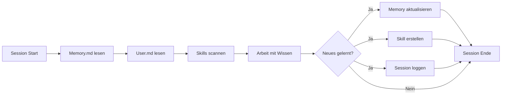

# MB-OS AI Memory System

> Wie ein KI-Agent aus Fehlern lernt und warum das alles verändert.

## Das Problem: KI ohne Gedächtnis

Jede KI-Session startet bei Null. Fehler werden wiederholt, Lösungen vergessen, Konventionen ignoriert. Bei einem komplexen Projekt wie einem Betriebssystem bedeutet das:

- **Gleiche Bugs** werden immer wieder eingeführt
- **Workarounds** müssen jedes Mal neu entdeckt werden
- **Projektregeln** (Coding-Standards, Architektur) gehen verloren
- **Nutzerpräferenzen** werden nicht berücksichtigt

## Die Lösung: Persistentes Gedächtnis

MB-OS hat ein dreistufiges AI-Gedächtnissystem:

```
~/.mb-os/memory/
├── Memory.md       ← Projektwissen, Regeln, bekannte Probleme
├── User.md         ← Nutzerprofil, Vorlieben, Kommunikationsstil
├── Skills/         ← Gelernte Lösungen als wiederverwendbare Rezepte
│   ├── grub-efi-repair.md
│   ├── mb-os-install-pipeline.md
│   ├── mb-os-ssh-remote.md
│   └── qml-polish-loop-fix.md
└── sessions.db     ← SQLite Session-Historie mit Volltextsuche
```

### Schicht 1: Memory.md (Projektwissen)
- Globale Regeln und Konventionen
- Bekannte Probleme und Workarounds
- Projektstruktur und Architektur
- Wird bei jedem Gespräch gelesen und aktualisiert

### Schicht 2: User.md (Nutzerprofil)
- Kommunikationsstil (Deutsch, direkt, pragmatisch)
- Technisches Niveau und Workflow
- Hardware-Setup und Zielgeräte
- Präferenzen ("nicht tippen", "alles per SSH", "Firefox statt Chrome")

### Schicht 3: Skills/ (Gelernte Lösungen)
- YAML-Frontmatter mit Trigger-Bedingungen
- Schritt-für-Schritt-Anleitungen
- Bekannte Fallen und Lösungen
- Automatisch anwendbar bei ähnlichen Problemen

## Realer Vergleich: 12h mit Memory vs. ~30h ohne

MB-OS wurde in einer 12-Stunden-Session gebaut. Ohne Memory hätten wir schätzungsweise 28-32 Stunden gebraucht:

### Verhinderte Fehler durch Memory System

| Gelernter Fehler | Konsequenz ohne Memory | Zeitersparnis |
|---|---|---|
| QML: `horizontalAlignment` auf Column crasht die App | App-Crash → Debugging → Fix → Repeat | ~1.5h |
| QML: Anker zum Parent in Row/Column → Polish-Loop | Schwarzer Bildschirm, kein Fehlerlog | ~2.0h |
| QML: `QProcess` braucht Wrapper-Scripts | Installer startet nicht, kryptische Fehler | ~1.5h |
| WSL2: NTFS verursacht D-State Hänger | Build friert ein, WSL Neustart nötig | ~1.0h |
| WSL2: Dateien VOR chroot kopieren | "File not found" mitten im Build | ~0.75h |
| GRUB: Background muss echtes PNG sein | Bootloader ohne Hintergrund, warum? | ~1.0h |
| GRUB: Unicode in Menüeinträgen → '?' | Unleserliches Boot-Menü | ~0.5h |
| Hyper-V: Gen2 + Secure Boot AUS | VM startet nicht, falscher Boot-Modus | ~1.0h |
| Hyper-V: `-nocursor` → kein Mauszeiger | Unsichtbare Maus, stundenlange Suche | ~0.5h |
| PowerShell: `$()` in SSH-Befehlen | Shell interpretiert Variablen falsch | ~0.75h |
| **Gesamt** | | **~10.5h** |

### Effizienz-Multiplikator

```
Mit Memory:    12h  (1.0x)
Ohne Memory:   30h  (2.5x langsamer)
Ersparnis:     18h  (60% weniger Arbeitszeit)
```

## Wie das Memory System lernt

### Automatischer Zyklus



### Skill-Beispiel: GRUB EFI Reparatur

```yaml
---
name: GRUB EFI Reparatur
trigger: "GRUB zeigt Kommandozeile statt Menü, grub> Prompt"
learned_from: Session 2026-06-14
confidence: high
---
```

Wenn ein ähnliches Problem auftritt, wird dieser Skill automatisch erkannt und die bewährte Lösung angewendet — ohne den Fehler erneut zu durchleben.

## Memory Daemon API

Der Memory Daemon läuft als systemd-Service auf Port 8000:

| Endpoint | Methode | Funktion |
|---|---|---|
| `/health` | GET | Status prüfen |
| `/memory/list` | GET | Alle Memories abrufen |
| `/memory/add` | POST | Neue Erinnerung speichern |
| `/memory/query` | POST | Semantische Suche |
| `/memory/skills` | GET | Gelernte Skills auflisten |

### Beispiel: Memory hinzufügen

```bash
curl -X POST http://localhost:8000/memory/add \
  -H "Content-Type: application/json" \
  -d '{"content": "Firefox spart 200MB RAM vs Chromium", "category": "browser"}'
```

## Architektur-Entscheidungen

| Entscheidung | Begründung |
|---|---|
| **Markdown statt SQL** | Lesbar, versionierbar, git-freundlich |
| **SQLite für Sessions** | Schnell, keine Dependencies, FTS5 Volltextsuche |
| **YAML Frontmatter** | Strukturierte Metadaten + freier Text |
| **Kein PostgreSQL/Neo4j** | Zu schwer für ein OS mit 512MB-2GB RAM |
| **FastAPI + uvicorn** | Leichtgewichtig, async, Python stdlib |

## Vergleich mit anderen Ansätzen

| Feature | MB-OS Memory | ChatGPT Memory | Typischer Agent |
|---|---|---|---|
| **Persistenz** | ✅ Lokal auf Disk | ☁️ Cloud-basiert | ❌ Keine |
| **Skills lernen** | ✅ YAML + Trigger | ❌ Nein | ❌ Nein |
| **User-Profil** | ✅ Detailliert | ⚠️ Begrenzt | ❌ Nein |
| **Projektregeln** | ✅ Komplett | ❌ Nein | ❌ Nein |
| **Session-Historie** | ✅ SQLite + FTS | ⚠️ Begrenzt | ❌ Nein |
| **Privacy** | ✅ 100% lokal | ❌ Cloud | - |
| **Kuratierung** | ✅ Automatisch | ❌ Manuell | - |
| **API-Zugang** | ✅ REST API | ❌ Nein | - |
| **RAM-Verbrauch** | ~40 MB | N/A | N/A |

## Fazit

Das Memory System ist der Unterschied zwischen einem KI-Assistenten der **bei jedem Gespräch bei Null anfängt** und einem der **wie ein erfahrener Kollege** arbeitet — mit Wissen über das Projekt, die Werkzeuge, die Fallen und die Vorlieben des Users.

**12 Stunden statt 30. Das ist die Kraft des Gedächtnisses.** 🧠
